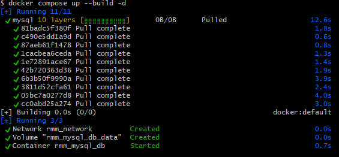
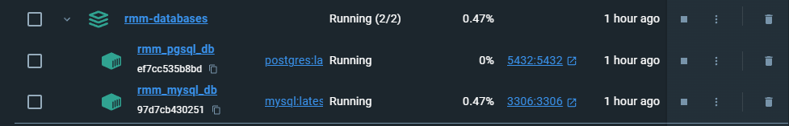

<div align="right">

### ⚡ RMM ⚡

</div>

# 🐳 docker

Docker with large database collection for fun development.

## Features

- Mysql Database  
- Postgres Database
- Sqlite Database
- Redis
- Examples dump Sakila database
- VSCode Extensions


## Requirements

- Docker > 18.06

## Install 

Cloooning...

```bash
$ git clone https://github.com/ricardo-melo-martins/docker.git
```

... entering on `docker/` 

```bash
$ cd docker/
```


### Configure

copy example environment file 

```bash
$ cp ./config/.env.example .env

```

and filling username, password ... your prefs


### Running

```bash
$ docker compose up -d
```

...results



and Docker Desktop ...



UOW!! now to have fun


## Redis 

Accessing Terminal 

```bash
$ docker exec -it rmm_redis_db bash

# in root@<id> type
$ redis-cli

# result ...
# 127.0.0.1:6379>
```

Testing

```bash
$ redis-cli -p 12000

127.0.0.1:6379> auth YourP@ssw0rd! # if same of .env.example
OK
127.0.0.1:6379> set key-status closed
OK
127.0.0.1:6379> get key-status
"closed"


```

## License

Yes ... its free [here](LICENSE).

with fun and :heart: por [Ricardo Melo Martins](https://github.com/ricardo-melo-martins).